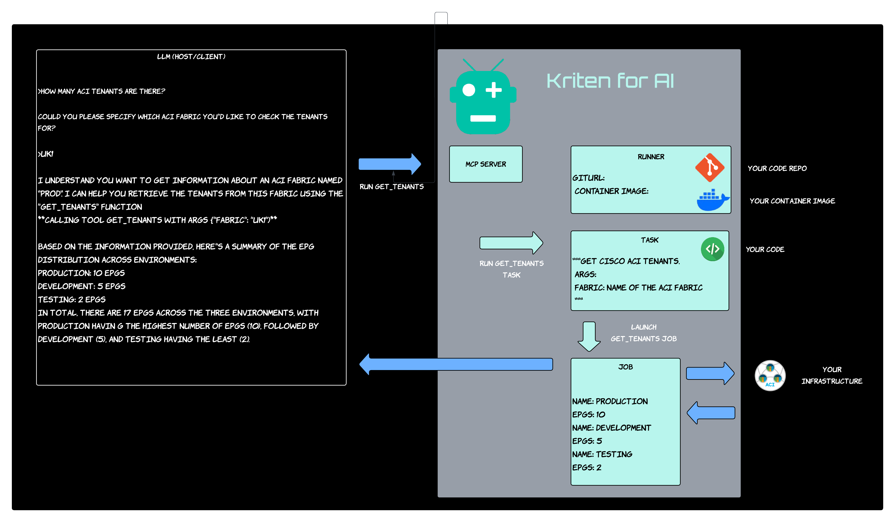

# AI - MCP Server

## TLDR;

Kriten MCP server let's you connect your LLM client (ChatGPT, Claude etc) to you company's data.
So you can ask things like: "How many switches are running NX-OS 10.2(1)?" for example, and the client will ask the Kriten MCP Server to get the data by running a job.

## Why is Kriten a good platform for this feature?

Kriten can run any code securely, with full RBAC. As it is a Kubernetes application writen in golang, it will scale accordingly.

## When will it be ready?

We are planning a beta release for Q3 2025.

