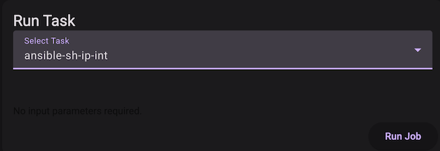
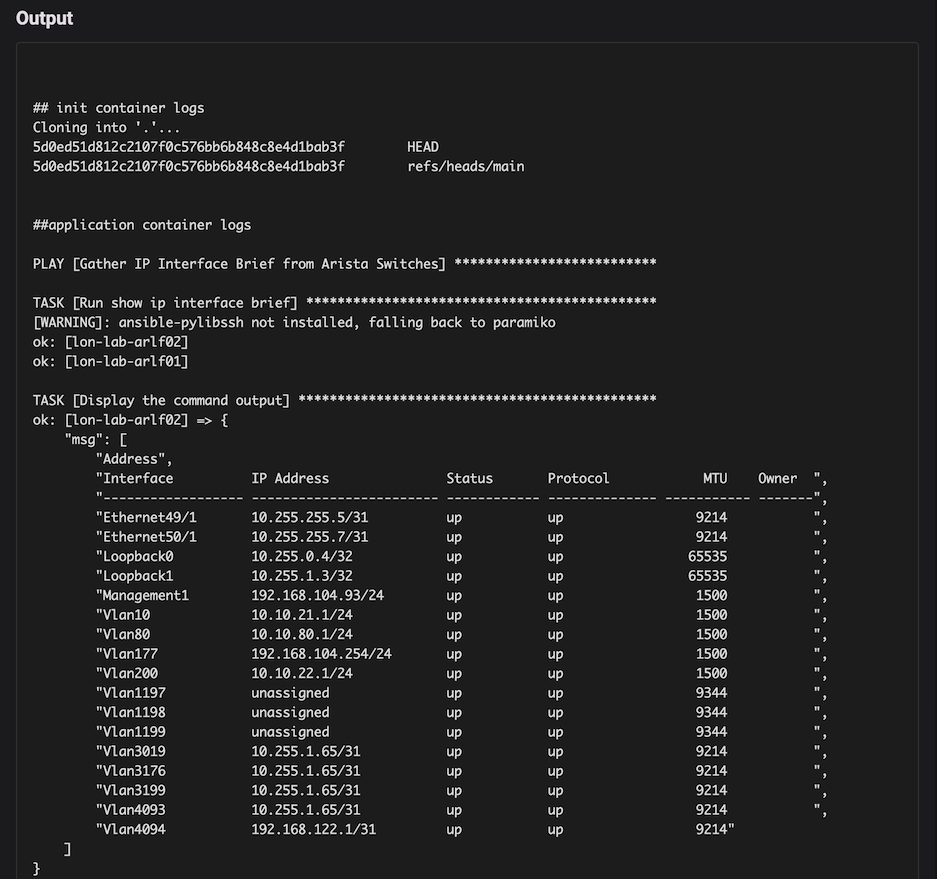

# Ansible

Ansible is an open-source IT automation tool used for configuration management, application deployment, and task orchestration.

## Running Ansible on Kriten

To run Ansible on Kriten, you need a container image with Ansible and any other pre-reqs installed, including any Ansible Galaxy collections.

## Ansible example

### Clone the kriten-community-toolkit repository
```sh
git clone https://github.com/kriten-io/kriten-community-toolkit.git
```
### Edit the files in the ```ansible/sh-ip-int``` directory.

| Path | Instructions |
|------|--------------|
| hosts.yml | Set the host names and IP addresses of devices in your network. |

> This is a simple script for demonstration purposes, please don't store credentials in production!

### Save your code to your own git repository.

### Build a container image (or use ours)

Use the ```Dockerfile``` to build a container image and push it to the registry used by your k8s cluster.
We have a public image on dockerhub at kubecodeio/ansible:2.21

### Add a runner in Kriten

| Field | Value |
|-------|-------|
| name | ansible-2.21.4 |
| image | kubecodeio/ansible:2.21 |
| gitURL | https://github.com/kriten-io/kriten-community-toolkit.git |
| branch | main |

### Add a task in Kriten

| Field | Value |
|-------|-------|
| name | ansible-sh-ip-int |
| runner | ansible-2.21.4  |
| command | cd ansible/sh-ip-int;ansible-playbook -i hosts.yml sh-ip-int.yml |
| schema | |

### Run task



### View job output


