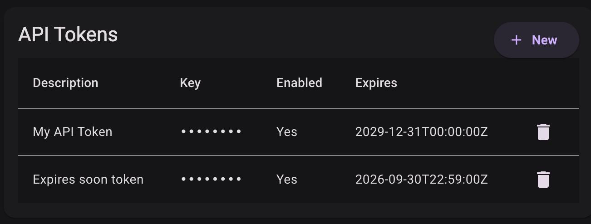
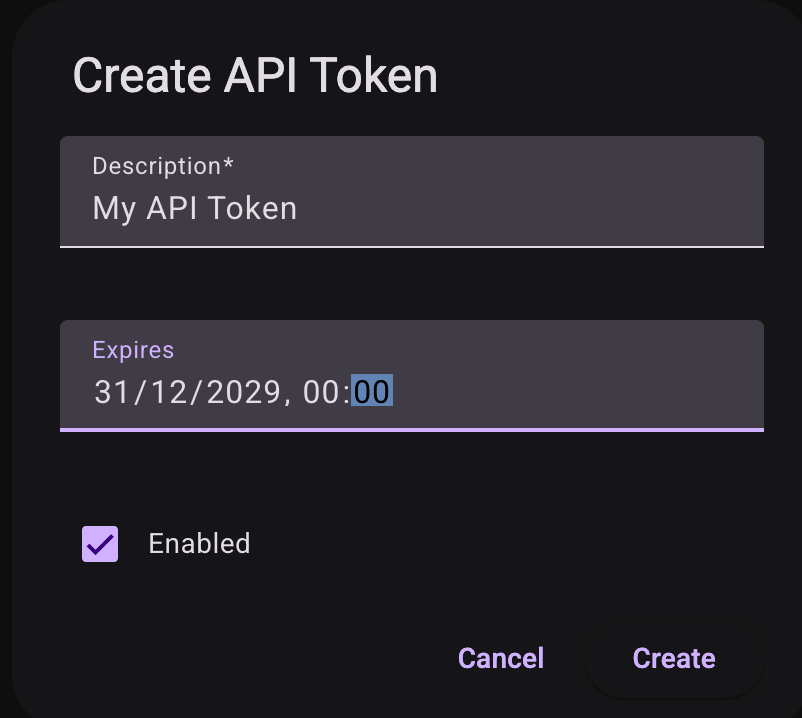
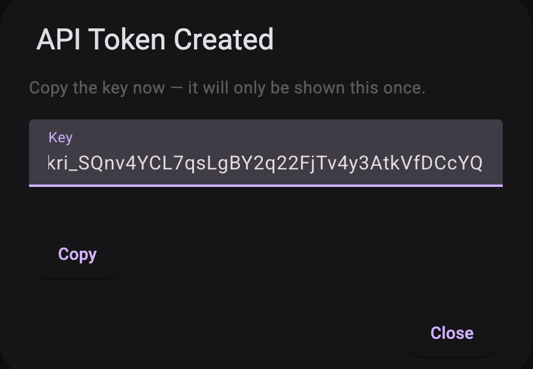

# API Tokens

Programmatic access to Kriten is provided via API tokens (keys). API tokens are generated per user and adhere RBAC rules.

* List API tokens

Select API Tokens from the account menu top right.
For non-admin user only own API tokens will be returned, if RBAC permissions not granted to get all.
Admin user will see all tokens by following query:

* Add API token
To create a token, select + New from the API Tokens menu.

API token object fields reference:

|Key| Description |
|---------|-----------|
|`description`|(Optional) description of the API token|
|`enabled`|(Optional) state of the API token - true or false, if not specified default will be True|
|`expires`|(Optional) If not specified, will never expire - data will be defaulted to 0000-01-01|

Copy the API key

