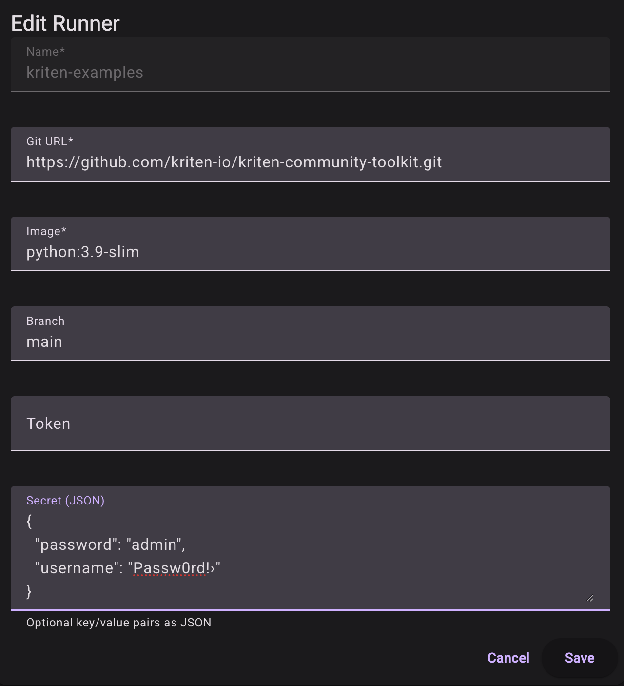
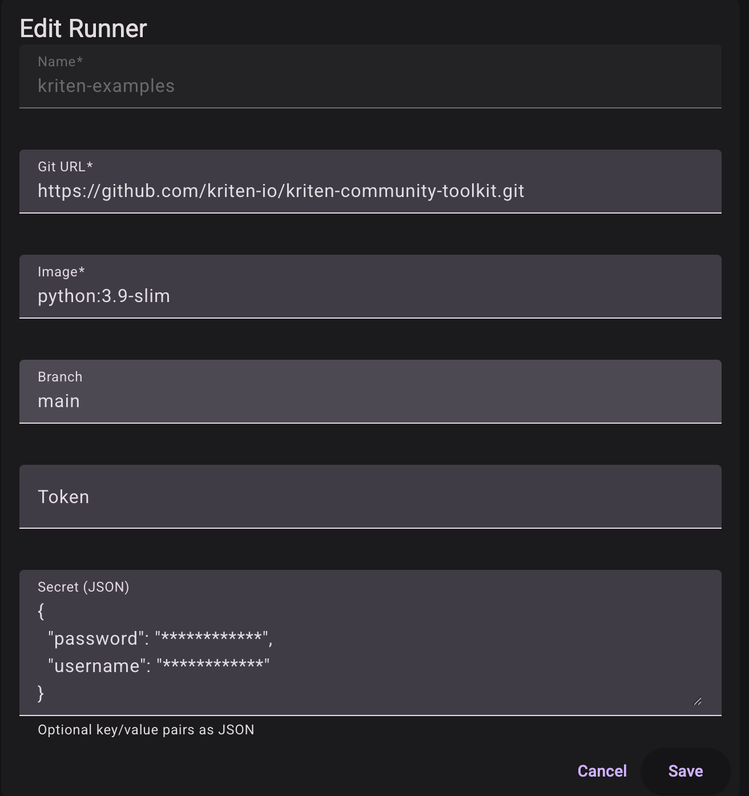

# Secrets

- [Secrets overview](#secrets-overview)
- [Reading secrets in your code](#reading-secrets-in-your-code)

## Secrets overview

Automation scripts always need secrets, i.e. tokens or credentials to access infrastructure devices, services, etc. Kriten provides facility to store secrets as Kubernetes secrets and makes them available at the time of Job launching as files in /etc/secret directory and also as environmental vars. Secrets are provisioned by admin users and not visible to executors of Tasks.

Secrets are associated with Runners. Runner defines execution environment - code repository with automation code, container image with all the packages and dependencies needed to run automation code, etc.



Secrets are defined in the `secret` field of the runner and can be created at the time of Runner creation or patching (update). After secrets created - they are obfuscated and won't be visible via Kriten.

Getting Runner info:



Produces response, where secrets are hidden and can't be observed.

Kriten provides endpoint for CRUD operation of secrets as `/api/v1/runners/$RUNNER_NAME/secret`, i.e. for above `/api/v1/runners/kriten-examples/secret`.

Following rules are applied at updating secrets:

|Condition| Behaviour|
|---------|-----------|
|secret key and non-empty value already present in stored secrets | No change|
|secret key and non-empty value == "************" (obfuscated) present or not |No change|
|secret key and empty value "" for existing secret | Delete stored secret with matching key|
|secret key and non-empty value non-existing secret | Add new secret|

## Reading secrets in your code

Kriten exposes task secrets to the Job container as files stored in /etc/secret/ directory.
Each key is a file with key name = file name, and the content is the value.

Python example:

```python
import os

secrets = {}
secrets_path = '/etc/secret/'
secret_files = os.listdir(secrets_path)

if secret_files:
    for file_name in secret_files:
        if os.path.isfile(secrets_path + file_name):
            with open(secrets_path + file_name, 'r') as f:
                value = f.read()
                secrets[file_name] = value
    print(f"Secrets {list(secrets.keys())} are set.")

else:
    print("No task secrets provided.")
```

Secrets are also exposed as environment varialbles in the Job container.

Python example:
```python
import os
API_KEY = os.environ.get("API_KEY")
```
