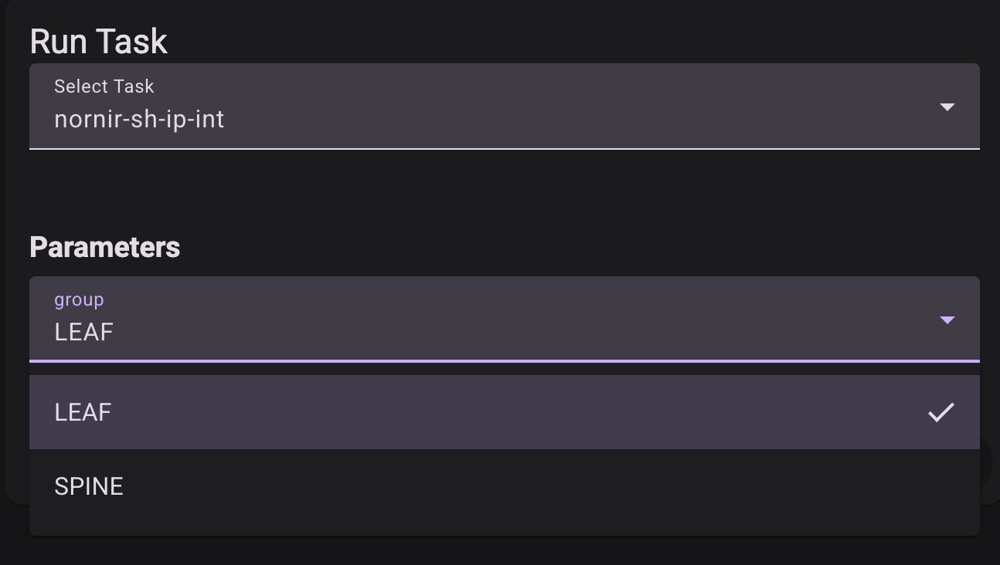
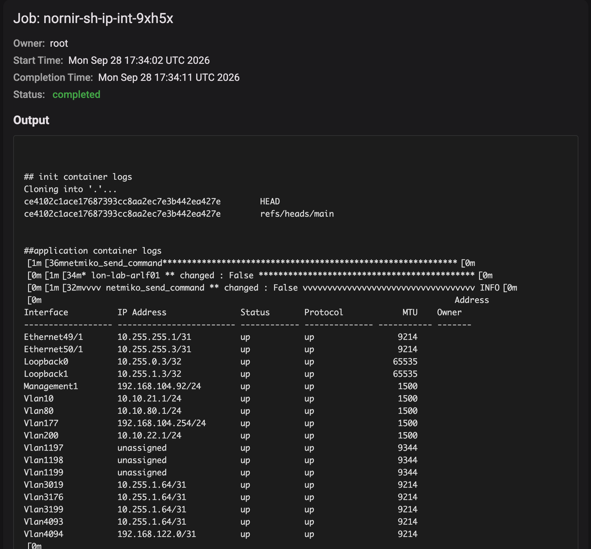

# Nornir

Nornir is an open-source, pure-Python automation framework built specifically for network engineering and multi-device orchestration.

## Running Nornir on Kriten

To run Nornir on Kriten, you need a container image with Nornir and any other pre-reqs installed, and your Nornir code.

## Nornir example

### Clone the kriten-community-toolkit repository
```sh
git clone https://github.com/kriten-io/kriten-community-toolkit.git
```

### Edit the code in the ```nornir``` directory.

| Path | Instructions |
|------|--------------|
| inventory/hosts.yml | Set the host names and IP addresses of devices in your network. Assign each device to a group. |
| inventory/groups.yml | Set to dictionary of group names. |
| inventory/defaults.yml | Set netmiko platform and credentials for your hosts.|

> This is a simple script for demonstration purposes, please don't store credentials in production!

In the script ```sh-ip-int.py``` variable ```group``` is read from EXTRA_VARS.

nr.filter(...) dynamically filters the inventory down to only devices that belong to that specific group.

switch_group.run(...) runs the "sh ip int brief" command concurrently, but only on the filtered subset of devices.

```python
import json
import os
from nornir import InitNornir
from nornir_utils.plugins.functions import print_result
from nornir_netmiko import netmiko_send_command
from nornir.core.filter import F

extra_vars = os.environ.get('EXTRA_VARS')

nr = InitNornir(config_file="./config.yml")

if extra_vars:
    extra_vars_data = json.loads(extra_vars)
    group = extra_vars_data["group"]
    switch_group = nr.filter(F(groups__contains=group))
    result = switch_group.run(netmiko_send_command, command_string="sh ip int brief")
else:
    result = nr.run(netmiko_send_command, command_string="sh ip int brief")

print_result(result)
```

### Save your code to your own git repository.

### Build a container image (or use ours)

Use the ```Dockerfile``` to build a container image and push it to the registry used by your k8s cluster.
We have a public image on dockerhub at kubecodeio/nornir:3.5.0

### Add a runner in Kriten

| Field | Value |
|-------|-------|
| name | nornir-3.5.0 |
| image | kubecodeio/nornir:3.5.0 |
| gitURL | https://github.com/kriten-io/kriten-community-toolkit.git |
| branch | main |

### Add a task in Kriten

| Field | Value |
|-------|-------|
| name | nornir-sh-ip-int |
| runner | nornir-3.5.0  |
| command | cd nornir; python sh-ip-int.py |
| schema | |
```json
{
  "properties": {
    "group": {
      "enum": [
        "LEAF",
        "SPINE"
      ],
      "type": "string"
    }
  },
  "required": [
    "group"
  ]
}
```

### Run task



### View job output


