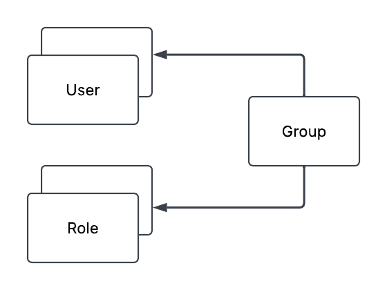
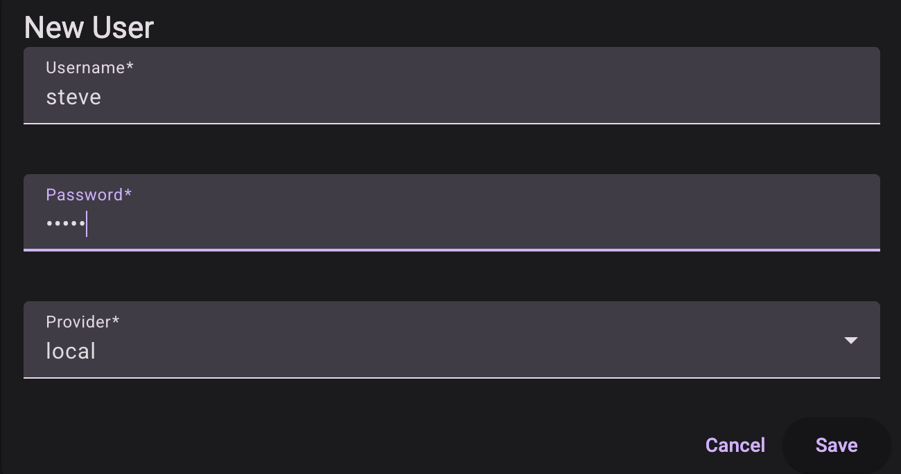
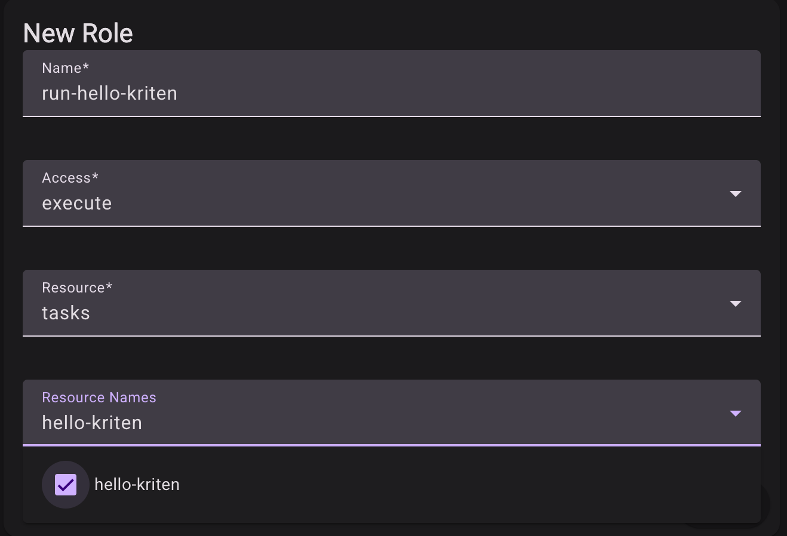
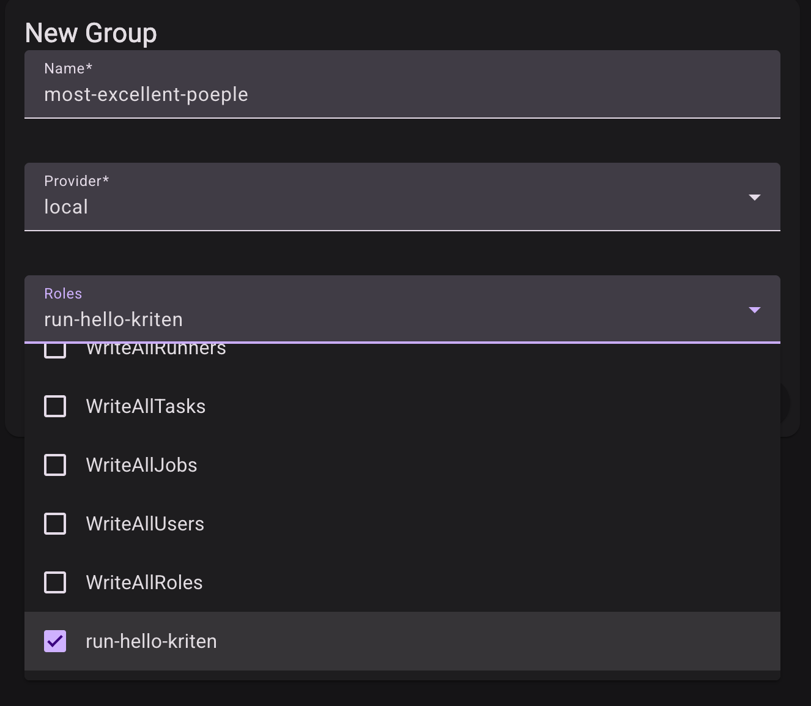
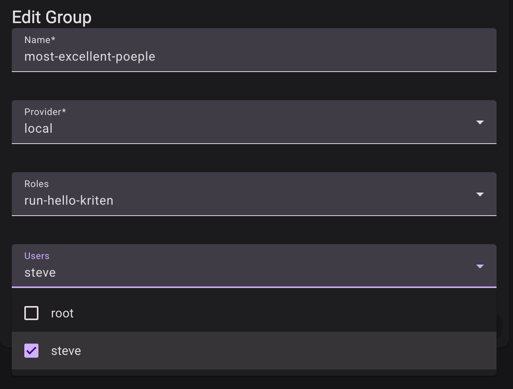
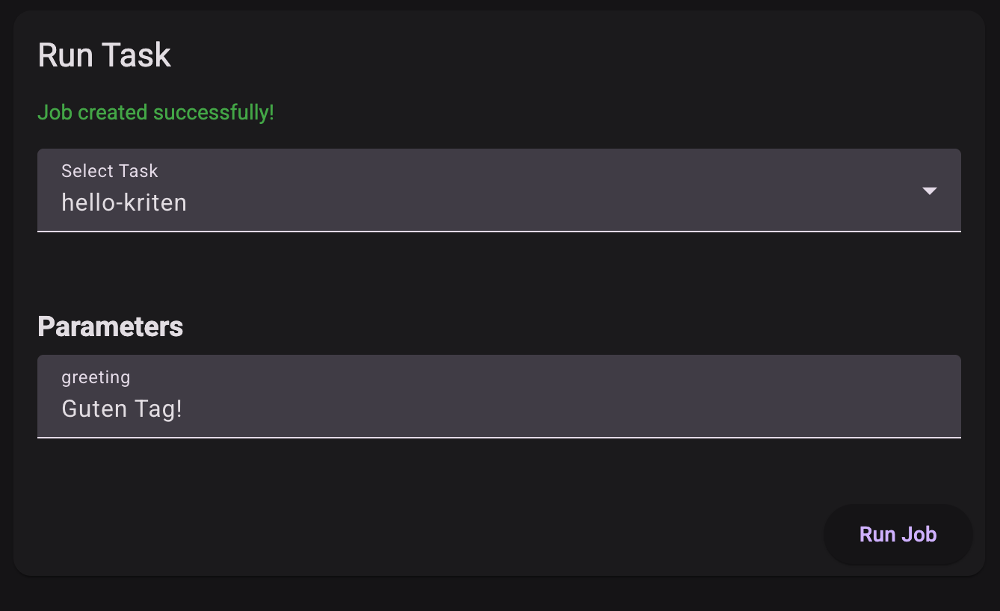

# Roles Based Access Control (RBAC)

## Table of Content

- [RBAC overview](#rbac-overview)
- [RBAC Example](#rbac-example)

## RBAC overview

Access to all resource types in Kriten is controlled by flexible and granular RBAC. RBAC controlls "read" or "write" permission to all resource types in Kriten: Runners, Tasks, Jobs, Users, Groups and Roles. Key components of RBAC are Users, Groups, and Roles defined as following:

* Users - only local users with provider type 'local' are currently supported in Community Edition. New users are created by root user or by already existing user with RBAC "write" permission to manage Users. Any newly created user doesn't have any default permissions other than login into Kriten.

* Group - permissions are granted by binding roles to local groups, thus user needs to be a member of a group to gain permissions.

* Role - role defines resource type (supported types are 'runners', 'tasks', 'jobs', 'users', 'roles') and array of resources of that type and permission: "read" or "write", where "read" allows only to read, and "write" allows everything, including modifications and deletions.
Tasks also have have 'execute' permission, which determines if a user can run a task, thereby crating a job.
Jobs only have 'read' permission.

> Only builtin roles can have resource name *. Custom roles must explicitly list resource names.

    There are pre-defined built-in roles, which are created at the time of installation of Kriten and cannot be modified or deleted.

    | Role Name              | Resource      | Resource Name | Permission |
    | ---------------------- | ------------- | ------------ | ---------- |
    | `Admin`                | *             | *            | write      |
    | `WriteAllRunners`      | runners       | *            | write      |
    | `WriteAllTasks`        | tasks         | *            | write      |
    | `WriteAllJobs`         | jobs          | *            | write      |
    | `WriteAllUsers`        | users         | *            | write      |
    | `WriteAllRoles`        | roles         | *            | write      |

For REST API swagger documentation refer to `$KRITEN_URL/swagger/index.html`

## RBAC Example

We will demonstrate RBAC on "ansible-command" example, available in https://github.com/kriten-io/kriten-examples repo. This is a simple ansible playbook, which allows execution of show commands on a network devices or a group of devices in inventory.

We will login as root user to create the Runner and the Task as per "ansible-command" example.  Only root user will be able to run Jobs against configured Task. We would like to create a new user, i.e. "user01" and we want that user to be able to run "ansible-command" Task, but not have access to read or modify Runner or Task itself. In example, $KRITEN_URL is set to the URL of your Kriten instance, eg. `export KRITEN_URL=http://kriten-community.kriten.io`.

1. Login as root

2. Create user "steve":

3. Logout and login as "steve"

4. Select Run

User is not able run a task.

5. Logout and login as "root"

6. Select Roles and + New

7. Select Groups and + New

8. Select the pencil edit the group

9. Logout and login as "steve"

10. Steve can now run task "hello-kriten"

> Note that steve can now also read hello-kriten job output irrespective of job owner.
