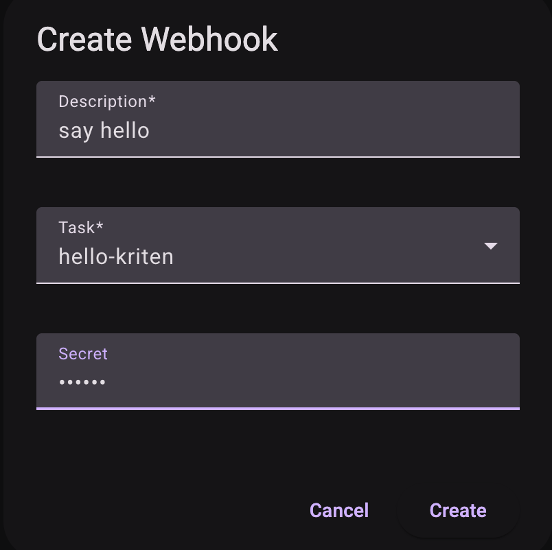
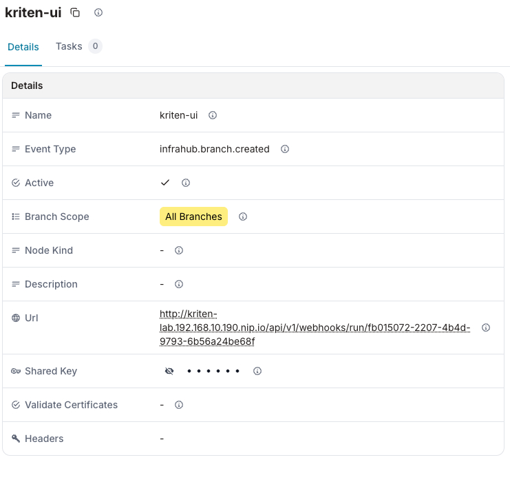
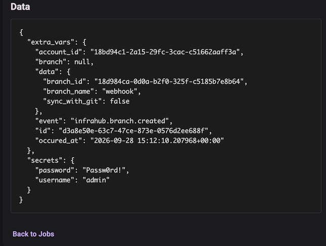
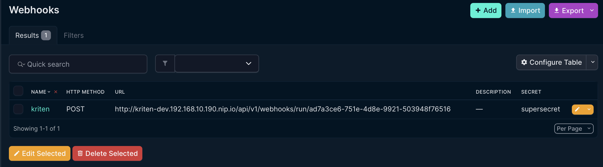
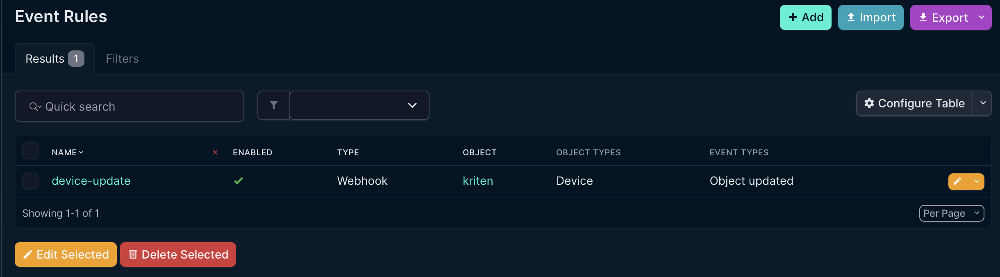
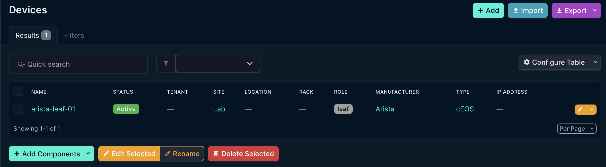

# Webhooks

For seamless integrations and to facilitate event driven automation, Webhook receiver capability was added into Kriten as of version 0.5. This version supports webhook integration with Infrahub (https://opsmill.com), Netbox (https://netboxlabs.com).

Kriten defines one-to-one mapping between a webhook and a kriten task. On successful webhook event, Kriten executes associated task and passes json body as json string via EXTRA_VARS environmental variable.

Webhooks are user defined and mapped to a user, inheriting user RBAC permissions. Webhooks are secured via shared secret, defined per webhook - that secret is used to calculate signature for body of request on sending end and to validate signature on receiving end. Note: Kriten requires shared secret to be provided, it supports only signed content for authentication purpose.

Current supported webhook impementations:

|System| HTTP Headers | Signature calculation
|---------|-----------|----------------------|
|`Infrahub`| "webhook-timestamp" - message timestamp, "webhook-id" - unique message id, "webhook-signature" - calculated signature| HMAC256 base64 digest calculated on string concatenation of header fields "webhook-timestamp", "webhook-id" and json body|
|`Netbox`|"X-Hook-Signature" - calculated signature| HMAC512 hex digest calculated on json body|

Note: Any system can add support for Kriten webhook by adhering to one of those implemented options.

## Configure Kriten webhook receiver

To demonstrate capability of webhook feature, we will be leveraging "hello-kriten" example from https://github.com/kriten-io/kriten-community-toolkit repo. This simple python app prints supplied input parameters exposed to it as EXTRA_VARS environmental variable. On webhook event, that variable will be populated with json body from sender. First, create a "hello-task" as documented in Getting Started section of User Guide.

* Create webhook for "hello-kriten" task

To execute this webhook, sender need to post to URL \$KRITEN_URL/api/v1/webhooks/run/\$ID, where $ID is "id" of above created webhook, and signature calculated with "secret".

Use the clipboard button to copy the webhook URL.

## Configure Infrahub webhook

* Create webhook in Infrahub

In Integrations -> Webhooks create Standard Webhook:

Creating a branch will trigger the webhook. The webhook event will be triggered and event data posted to Kriten webhook receiver, which will execute task "hello-kriten".

> Note that tasks triggered by webhooks must not have input schema.

* View job output

## Configure Netbox Webhook

For demonstration purpose, for Netbox we will use the same webhook we created for Infrahub, as we are not doing anything with data passed via webhook, but only priting it out from python script.

* Create webhook in Netbox

In Integrations -> Webhooks create a webhook. Define HTTP method POST, provide Kriten webhook URL and secret.

* Create Event rule

Event Rule defines event, i.e. devide added, removed, updated, and so on and maps it to configured webhook.

In Integrations -> Event Rules, create a rule, as example, to trigger event on device update.

There is device in the Netbox:

To trigger the event modify status of the device.
