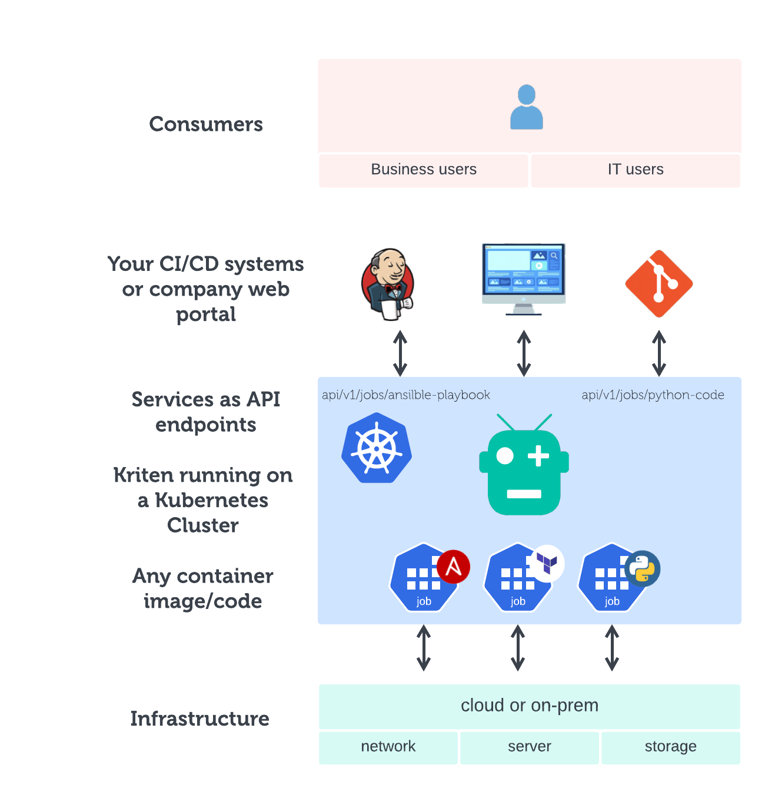

# Why Kriten?

## Infrastructure Automation is Hard

Infrastructure teams are usually organised by discipline; Server, Network, Storage for example. Automation routines have to work cross-domains to provide a service. Kriten allows engineers to publish their own routines, using the languages and tools that best suit. Consumers can run the routines by calling an authorised API endpoint. Kriten creates the endpoint and runs the code on a Kubernetes cluster, engineers can focus on their code. A full RBAC scheme is provided to control who can modify or run code.

## It works on my laptop

IT professionals have been coding scripts to simplify tasks for many years. The challenge is how to make them available to other consumers.

The consumers need:

- A simple and consistent way to run the code.

The developers need:

- A simple way to publish the code.
- A simple way to integrate with other systems.

The infratructure owners need:

- A consistent way to ensure authentication and authorisation.
- Assurance that secrets and sensitve data is not exposed.
- Audit trail.
- A reliable and scalable platform.

## “Genius is making complex ideas simple, not making simple ideas complex.”

Code in any language can be published in 2 steps (or less in some cases). 
Kriten takes care of building an API endpoint that consumers can use to run the code.
The code is run on Kubernetes, leveraging the scalability, reliability and portability benefits, but after installation no Kubernetes knowledge is needed.

## Open-source

As custodians, we are committed to maintaining and improving Kriten. It is free to use, without limitation. To fund continued development, we have support options for bug-fix and feature development.
